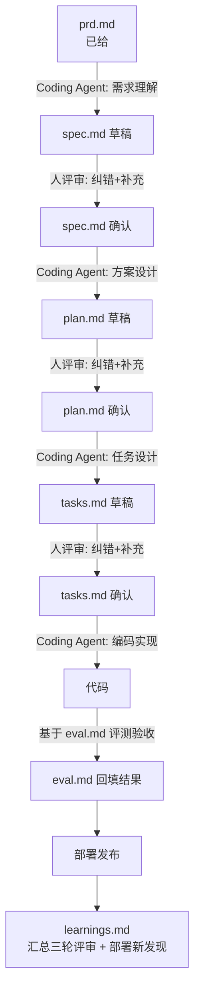

# 招商证券 AI Coding 实战工作坊 · 0.5 天分组实战

题目：《企业级高可用多智能体客服 AI 智能体系统》。详细需求见 [`prd.md`](./prd.md)。

## 这是什么

1.5 天工作坊的最后 3 小时，每组从 `prd.md` 出发，完整走一遍 SDD（Spec-Driven Development）链路。**五份产出文档本身也是 Coding Agent 起草的**，人不从零手写，只做评审（纠错 + 补充），确认后再进入下一步：



每一轮评审的纠错和补充**当场记进 `learnings.md`**，不要留到最后凭记忆补——三轮评审是 `learnings.md` 最主要的素材来源。

## 怎么开始

1. 通读 [`prd.md`](./prd.md)，尤其是 §2（需求分类，至少选 2 类）、§4（验收标准）、§5（五份产出文档的定义与硬规则）。
2. 把 `templates/` 下的五个模板复制到你们组的工作分支根目录，去掉文件名里的 `.template`（这些是给 Coding Agent 起草时参照的结构，不是要你们手工填空）：

   ```
   templates/spec.template.md      → spec.md
   templates/plan.template.md      → plan.md
   templates/tasks.template.md     → tasks.md
   templates/eval.template.md      → eval.md
   templates/learnings.template.md → learnings.md
   ```

3. 按下面的分阶段 prompt，让 Coding Agent 依次起草 `spec.md` → `plan.md` → `tasks.md`，每一份起草完都先人工评审（对照 `spec.md` §2/§5 这类不能省的节重点检查），改完再进入下一阶段。
4. `tasks.md` 确认后，让 Coding Agent 按 T-01→T-07 顺序编码实现。
5. T-06：按 `eval.md` 定义的用例跑测试，把结果回填进 `eval.md`。
6. 部署发布：把 demo 实际跑起来，确认能被现场访问。
7. T-07：汇总 `learnings.md`（三轮评审记录 + 部署中的新发现），准备现场演示。

## 怎么喂给 Coding Agent（分阶段 prompt）

**① 起草 spec.md**

```
请阅读 prd.md，做需求理解，参照 templates/spec.template.md 的九节结构和
frontmatter 字段起草 spec.md。§2（业务语义与元语消歧）和 §5（验收标准，用
US-编号）不能省。不要涉及架构设计（用几个智能体、用什么框架），那是下一步
plan.md 的事。
```

**② spec.md 人工确认后，起草 plan.md**

```
spec.md 已经过人工评审确认。请阅读确认版的 spec.md 和 prd.md，做方案设计，
参照 templates/plan.template.md 的八节结构起草 plan.md，§6"不改清单"要
列清楚哪些是硬约束、编码时不能碰。
```

**③ plan.md 人工确认后，起草 tasks.md（含 eval.md 用例）**

```
plan.md 已经过人工评审确认。请阅读确认版的 plan.md，做任务拆解，参照
templates/tasks.template.md 的 T-01~T-07 结构起草 tasks.md，每项要有明确的
verify 命令。同时参照 templates/eval.template.md §1.1，先写出 ≥20 条路由
准确率测试用例（编码前的验收靶子，不用等代码写完再想）。
```

**④ tasks.md 人工确认后，开始编码**

```
tasks.md 已经过人工评审确认。请严格按 T-01 到 T-07 顺序实现，每完成一项跑
一下对应的 verify 命令，通过后把状态改成 ✅ 并在"说明"里简述实现方式。遇到
spec.md / plan.md 没覆盖的情况，按最小合理假设处理并说明假设，不要擅自扩大
范围，且不允许改动 plan.md §6"不改清单"里列出的内容。T-06 完成后把测试结果
回填进 eval.md 并给出判定结论。
```

**⑤ eval.md 判定通过后，部署发布 + 结项**

```
eval.md 判定结论为"通过"或"有条件通过"后，请把 demo 跑起来（给出启动命令/
访问方式），并汇总本次三轮评审（spec.md/plan.md/tasks.md）里记录的纠错与
补充，连同编码、评测阶段发现的问题，整理进 learnings.md 的 L-01~L-05。
```

## 目录结构

```
prd.md                          业务需求（已给，不要修改）
assets/ui-reference.svg         PRD 引用的 UI 参考图
templates/                      五份产出文档的结构模板（Coding Agent 起草时参照，人评审后重命名去掉 .template）
  spec.template.md
  plan.template.md
  tasks.template.md
  eval.template.md
  learnings.template.md
```

## 验收标准

见 [`prd.md` §4](./prd.md#4-验收标准与交付物)。核心是：基准场景（Golden Path）跑通、两大类各 ≥3 个场景正确路由、路由准确率 ≥85%、能演示一次高可用降级、执行过程可解释。
