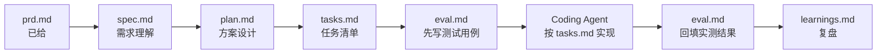

# 招商证券 AI Coding 实战工作坊 · 0.5 天分组实战

题目：《企业级高可用多智能体客服 AI 智能体系统》。详细需求见 [`prd.md`](./prd.md)。

## 这是什么

1.5 天工作坊的最后 3 小时，每组从 `prd.md` 出发，完整走一遍 SDD（Spec-Driven Development）链路，最后由 Coding Agent 基于文档产出代码：



代码由 Coding Agent 依据 `spec.md` / `plan.md` / `tasks.md` 生成，不是人工从零手写——这三份文档写得够清楚，是编码环节能顺利跑起来的前提。

## 怎么开始

1. 通读 [`prd.md`](./prd.md)，尤其是 §2（需求分类，至少选 2 类）、§4（验收标准）、§5（五份产出文档的定义与硬规则）。
2. 把 `templates/` 下的五个模板复制到你们组的工作分支根目录，去掉文件名里的 `.template`：

   ```
   templates/spec.template.md      → spec.md
   templates/plan.template.md      → plan.md
   templates/tasks.template.md     → tasks.md
   templates/eval.template.md      → eval.md
   templates/learnings.template.md → learnings.md
   ```

3. 按 `prd.md` §6 的时间节奏，依次填写 `spec.md` → `plan.md` → `tasks.md`（含 `eval.md` 的测试用例部分）。`spec.md` §2（消歧）和 §5（验收标准）是唯一不能省的两节，其余节时间紧张可以简写。
4. 把 `spec.md`、`plan.md`、`tasks.md` 交给 Coding Agent，让它按 `tasks.md` 的 T-01→T-07 顺序实现（`templates/tasks.template.md` 末尾有一段可直接复制的起始 prompt）。
5. 编码完成后（对应 `tasks.md` 的 T-06），按 `eval.md` 定义的用例跑测试，把结果回填进 `eval.md`。
6. T-07：写 `learnings.md` 复盘，准备现场演示。

## 目录结构

```
prd.md                          业务需求（已给，不要修改）
assets/ui-reference.svg         PRD 引用的 UI 参考图
templates/                      五份产出文档的模板（复制后重命名再填写，不要直接改模板本身）
  spec.template.md
  plan.template.md
  tasks.template.md
  eval.template.md
  learnings.template.md
```

## 验收标准

见 [`prd.md` §4](./prd.md#4-验收标准与交付物)。核心是：基准场景（Golden Path）跑通、两大类各 ≥3 个场景正确路由、路由准确率 ≥85%、能演示一次高可用降级、执行过程可解释。
