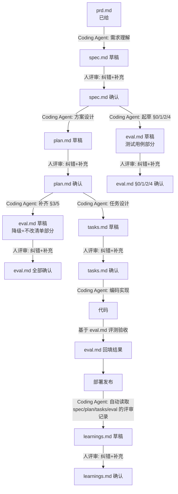

# 招商证券 AI Coding 实战工作坊 · 0.5 天分组实战

题目：《企业级高可用多智能体客服 AI 智能体系统》。详细需求见 [`prd.md`](./prd.md)。

## 这是什么

2 天工作坊的最后 3 小时，每组从 `prd.md` 出发，完整走一遍 SDD（Spec-Driven Development）链路。**五份产出文档全部由 Coding Agent 起草**，人不从零手写，只做评审（纠错 + 补充），确认后再进入下一步：



`eval.md` 不是单一来源：测试用例部分（§0/§1/§2/§4）只依赖确认版的 `spec.md`，跟 `plan.md` 是并行的两条分支，不用等它；但降级测试和不改清单核对部分（§3/§5）结构上依赖 `plan.md`（§3 核对 plan.md §5 的降级设计，§5 核对 plan.md §6 的不改清单），要等 `plan.md` 确认后再补——不用等到编码完成，也不卡编码开始。每一轮评审的纠错和补充，记在对应文档自己的"变更记录"里就够了——`learnings.md` 最后由 Coding Agent 自动读取这四处生成，人不需要在过程中另外维护一份日志。

## 怎么开始

1. 通读 [`prd.md`](./prd.md)，尤其是 §2（需求分类，至少选 2 类）、§4（验收标准）、§5（五份产出文档的定义与硬规则）。
2. 把 `templates/` 下的五个模板复制到你们组的工作分支根目录，去掉文件名里的 `.template`（这些是给 Coding Agent 起草时参照的结构，不是要你们手工填空）：

   ```
   templates/spec.template.md      → spec.md
   templates/plan.template.md      → plan.md
   templates/tasks.template.md     → tasks.md
   templates/eval.template.md      → eval.md
   templates/learnings.template.md → learnings.md
   ```

3. 按下面的分阶段 prompt，让 Coding Agent 起草 `spec.md`，评审确认后并行起草 `plan.md` 和 `eval.md`（此时 `eval.md` 只能先写测试用例部分 §0/§1/§2/§4）。每一份起草完都先人工评审（对照 `spec.md` §2/§5 这类不能省的节重点检查，纠错和补充记进该文档自己的"变更记录"），改完再进入下一阶段。
4. `plan.md` 确认后，让 Coding Agent 补齐 `eval.md` 的 §3/§5（依赖 plan.md 的降级设计和不改清单），同时起草 `tasks.md`；两者评审确认。
5. `tasks.md` 确认后，让 Coding Agent 按 T-01→T-07 顺序编码实现。
6. T-06：按 `eval.md` 定义的用例跑测试，把结果回填进 `eval.md`。
7. 部署发布：把 demo 实际跑起来，确认能被现场访问。
8. T-07：让 Coding Agent 自动读取 `spec.md`/`plan.md`/`tasks.md`/`eval.md` 的变更记录生成 `learnings.md`，人评审确认，准备现场演示。

## 怎么喂给 Coding Agent（分阶段 prompt）

**① 起草 spec.md**

```
请阅读 prd.md，做需求理解，参照 templates/spec.template.md 的九节结构和
frontmatter 字段起草 spec.md。§2（业务语义与元语消歧）和 §5（验收标准，用
US-编号）不能省。不要涉及架构设计（用几个智能体、用什么框架），那是下一步
plan.md 的事。
```

**② spec.md 人工确认后，并行起草 plan.md 和 eval.md**

```
spec.md 已经过人工评审确认。请阅读确认版的 spec.md 和 prd.md，做方案设计，
参照 templates/plan.template.md 的八节结构起草 plan.md，§6"不改清单"要
列清楚哪些是硬约束、编码时不能碰。
```

```
spec.md 已经过人工评审确认。请阅读确认版的 spec.md，做验收判定设计，参照
templates/eval.template.md 起草 eval.md 的 §0、§1（AC 覆盖矩阵 + §1.1 路由
准确率测试用例，至少 20 条，对照 spec.md §5 每条 US 编号）、§2（验证范围）、
§4（非功能门槛），不用等 plan.md / tasks.md 存在。§3（系统级回归确认）和
§5（不改清单核对）依赖 plan.md，先留空，等 plan.md 确认后再补。
```

**③ plan.md 人工确认后，起草 tasks.md，并补齐 eval.md §3/§5**

```
plan.md 已经过人工评审确认。请阅读确认版的 plan.md，做任务拆解，参照
templates/tasks.template.md 的 T-01~T-07 结构起草 tasks.md，每项要有明确的
verify 命令。同时把 eval.md 的 §3（系统级回归确认，对照 plan.md §5 的降级
设计填"期望降级行为"）和 §5（不改清单核对，把 plan.md §6 的条目原样搬过来）
补齐。
```

**④ tasks.md 人工确认后，开始编码**

```
spec.md、plan.md、tasks.md、eval.md 均已经过人工评审确认。请严格按 tasks.md
的 T-01 到 T-06 顺序实现，每完成一项跑一下对应的 verify 命令，通过后把状态
改成 ✅ 并在"说明"里简述实现方式。遇到 spec.md / plan.md 没覆盖的情况，按
最小合理假设处理并说明假设，记进对应文档的"变更记录"，不要擅自扩大范围，且
不允许改动 plan.md §6"不改清单"里列出的内容。T-06 完成后把测试结果回填进
eval.md 并给出判定结论。
```

**⑤ eval.md 判定通过后，部署发布**

```
eval.md 判定结论为"通过"或"有条件通过"后，请完成 tasks.md 的 T-07：把 demo
跑起来，给出启动命令/访问方式。
```

**⑥ 部署完成后，生成 learnings.md**

```
请自动读取 spec.md、plan.md、tasks.md、eval.md 各自的"变更记录"，提炼出
L-01~L-05（问题/根因/修复/回流/可复用性），参照 templates/learnings.template.md
的结构起草 learnings.md。挑真实发生、有具体落点的记录，不用凑够五条。
```

## 目录结构

```
prd.md                          业务需求（已给，不要修改）
assets/ui-reference.svg         PRD 引用的 UI 参考图
templates/                      五份产出文档的结构模板（Coding Agent 起草时参照，人评审后重命名去掉 .template）
  spec.template.md
  plan.template.md
  tasks.template.md
  eval.template.md
  learnings.template.md
```

## 验收标准

见 [`prd.md` §4](./prd.md#4-验收标准与交付物)。核心是：基准场景（Golden Path）跑通、两大类各 ≥3 个场景正确路由、路由准确率 ≥85%、能演示一次高可用降级、执行过程可解释。
