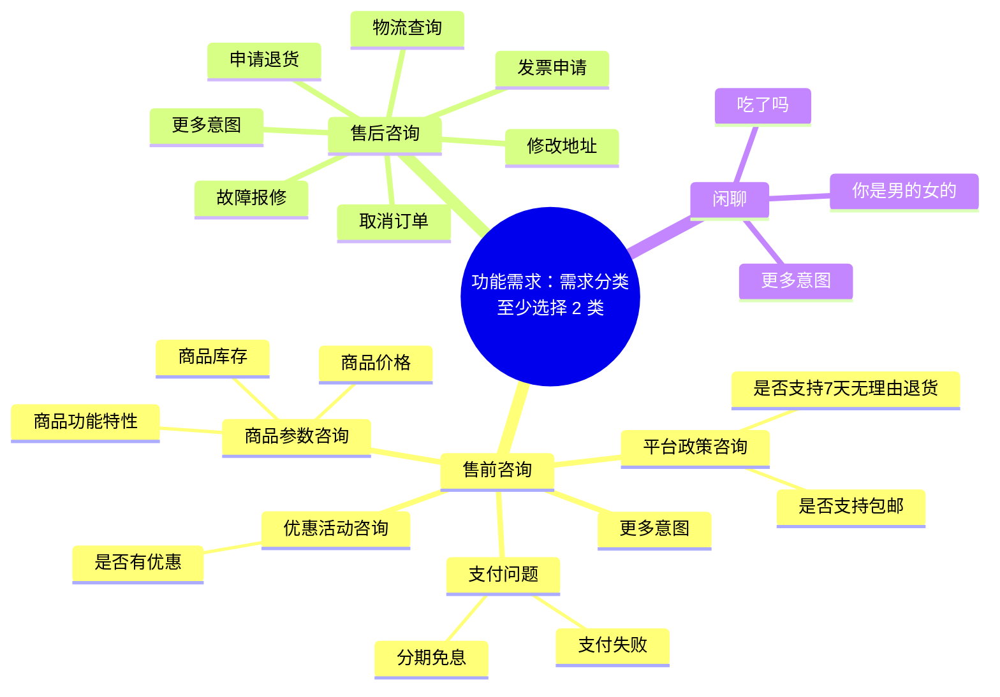
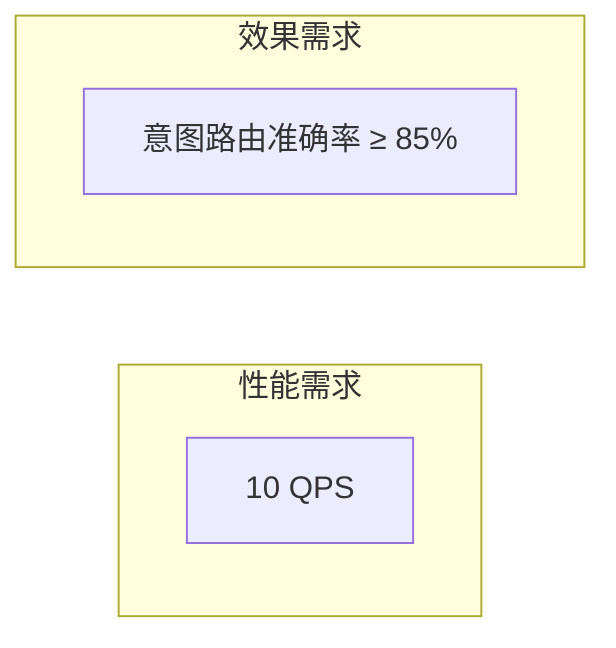
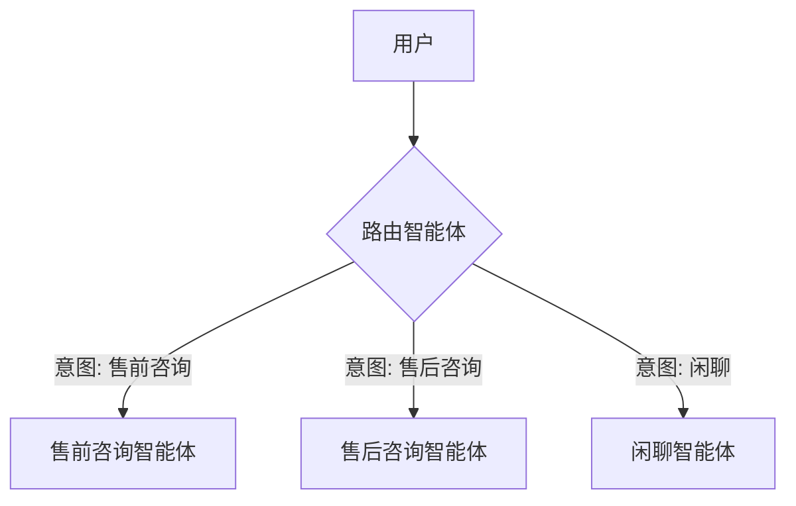
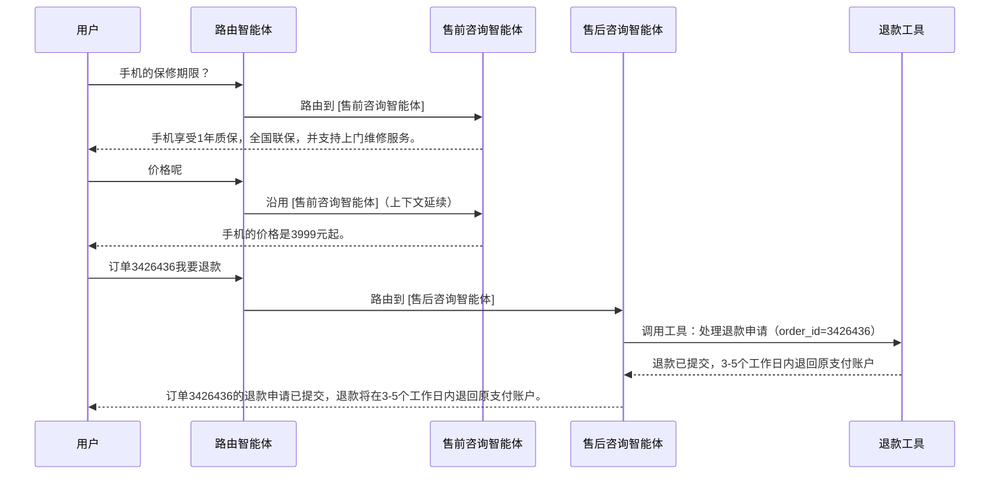

<!-- ──────────────────────────────────────────────────────────────
  prd.md ｜ 企业级高可用多智能体客服 AI 智能体系统（培训实战需求）

  为什么是这份文件      1.5 天工作坊的最后 0.5 天（3 小时）是分组实战：
        学员要把前 1 天学到的 AI Coding / SDD 方法论，在一个"看得见、
        验得了"的题目上跑通一次完整闭环——从这份 PRD 出发，自己走完
        spec.md → plan.md → tasks.md → eval.md，再交给 Coding Agent
        实现，最后写 learnings.md 复盘。

  刻意不加工      本文件只描述业务意图、参考素材和验收线，不指定智能体
        怎么划分、用什么框架、代码怎么写。这是有意为之：
        「PRD → 需求理解 → 方案设计 → 实现」这条推导链，正是本次实战
        要考察的能力，提前把设计给出来，练习就失去了意义。

  谁写      培训教学组。参考素材来自真实的多智能体客服系统截图与需求脑图，
        但截图文件本身未随附件一起提供，故本文件用 Mermaid 图 + 表格
        + 示例对话脚本，等价还原了截图中的关键信息（分类脑图、性能/效果
        指标、UI 三栏布局、执行流程与拓扑图），供各组直接对照实现与验收。

  下一站      各小组依次产出（模板见 templates/ 目录）：
        spec.md（需求理解：范围、场景、验收口径）
        → plan.md（方案设计：智能体划分、路由策略、工具/数据、降级策略）
        → tasks.md（任务拆解，供 Coding Agent 顺序执行）
        → eval.md（先定测试用例，AI Coding 后回填实测结果）
        → AI Coding 实现 → learnings.md（复盘）→ 现场演示与验收。
        完整流程说明见本文件 §5。
────────────────────────────────────────────────────────────── -->

# PRD-2026-CMS-WORKSHOP-001｜企业级高可用多智能体客服 AI 智能体系统

> 提出：AI Coding 实战工作坊教学组　场景：招商证券 AI Coding 实战工作坊　用时：0.5 天（3 小时）分组实战

## 1. 背景

工作坊前 1 天完成了 AI Coding 方法论与工具训练，最后 0.5 天（3 小时）是分组实战：每组用 AI 编码工具，从一份 PRD 出发，独立完成一个**企业级高可用多智能体客服 AI 智能体系统**的需求理解、架构设计与实现，并现场演示。

选客服场景的原因：

- 业务足够贴近真实工作（证券/电商类客服都适用），意图分类清晰，不需要额外的领域知识铺垫；
- 天然适合"多智能体协作"这个训练重点——单一 Agent 硬扛所有意图会又臃肿又难兜底，必须做路由与职责拆分；
- "高可用"这个企业级要求，能强制学员在 3 小时内也要考虑异常兜底、可观测性，而不是只做一条 happy path。

参考素材：某多智能体客服系统的需求分类脑图、性能/效果指标、以及一版基于 LlamaIndex ReAct 架构的演示 UI 截图（对话 / 执行流程 / 智能体拓扑图三栏布局）。原始截图文件未随本次任务一并提供，下文用 Mermaid 图与表格等价还原了其中信息，供各组对照实现——这份还原本身也比截图更适合直接喂给 AI 编码工具做参考。

## 2. 需求

**做一个多智能体客服系统：用户输入一句话，系统能自动判断意图归属的类别，路由给对应的专业智能体处理，并给出正确、可用的答复。**

### 2.1 需求分类（至少选择 2 类落地）

- **必选**：售前咨询、售后咨询 —— 两类都要有真实可用的子智能体，不能只做路由不做处理。
- **可选加分**：闲聊类，用于兜底与体验加分（不在核心验收范围内）。
- 每一类下的具体意图（如"商品价格""申请退货"）不要求全覆盖，每类至少落地 **3 个具体场景**，能被正确识别并给出正确答复即可；其余场景可以用统一的"暂不支持，请转人工"类兜底话术承接，但**不能报错、不能无响应**。
- "申请退货 / 退款"是本次的**基准场景（Golden Path）**，所有组必须跑通（见第 7 节示例对话）。

### 2.2 非功能需求

| 类别 | 指标 | 说明 |
|---|---|---|
| 性能需求 | 10 QPS | 系统需能承受至少 10 QPS 的并发请求而不崩溃或显著降级；现场验收以模拟并发请求方式抽测。 |
| 效果需求 | 意图路由准确率 ≥ 85% | 用一批未在开发阶段用于调优的测试语句抽测，正确路由到对应智能体（且给出合理答复）的比例需 ≥ 85%。 |
| 高可用需求 | 子智能体 / 工具调用失败不能打断整体对话 | 任一子智能体或外部工具（如订单查询、退款接口）超时、报错、被限流时，系统需能重试或降级兜底（如返回"当前繁忙，请稍后再试或转人工"），不能让前端卡死或抛出未处理异常。 |
| 可观测性需求 | 关键决策与调用需可追踪 | 路由决策、被调用的智能体、工具调用（含参数）、工具返回结果需要有带时间戳的执行记录，对应 UI 的"执行流程"面板，用于问题排查与演示讲解。 |

## 3. 交互（UI 参考）

参考截图为三栏式演示界面（基于 LlamaIndex ReAct 架构的示例，仅供布局与交互参考，不强制照抄实现方式）：

> 图中的对话内容对应第 7 节的基准场景（保修期限 → 价格 → 订单退款），执行流程面板展示了路由决策、智能体调用、工具调用与返回的完整链路。

| 面板 | 内容 |
|---|---|
| 左栏「对话」 | 用户与客服的多轮对话气泡，输入框 + 发送按钮。 |
| 中栏「执行流程」 | 实时滚动展示：路由决策 → 分派到哪个子智能体 → 调用了什么工具（含参数）→ 工具返回结果 → 处理完成，每条都带时间戳；支持"清空"。 |
| 右栏「智能体拓扑图」 | 展示"用户 → 路由智能体 → {售前咨询 / 售后咨询 / 闲聊}"的静态拓扑关系图，当前被激活的路径可高亮（加分项，非必做）。 |

拓扑图等价还原：

- 三栏布局是**参考**，不是强制规范：命令行 Demo、单栏 Web 页面均可接受，但"对话结果"与"关键执行过程可见"两点是硬性要求——评审需要能看到系统"为什么这么答"，不能是黑盒。
- UI 美观度不计入核心验收分，功能正确性与可解释性优先。

## 4. 验收标准与交付物

现场演示需覆盖以下几点，缺一不可：

1. **基准场景跑通**：按第 7 节的示例对话脚本，现场演示"售前咨询（保修/价格）→ 售后咨询（退款）"的完整多轮对话，路由与答复均正确。
2. **两大类各 3 个场景**：售前咨询、售后咨询各自至少 3 个具体意图场景，现场随机抽问，正确路由并给出合理答复。
3. **准确率抽测**：评审用 ≥ 20 条未公开的测试语句现场抽测，路由准确率需 ≥ 85%。
4. **高可用兜底演示**：现场模拟一次工具调用失败或超时（如把订单接口临时改成必错），系统需能给出兜底话术而不是报错或无响应。
5. **执行过程可解释**：能展示（无论以 UI 面板、日志还是终端输出形式）路由决策与工具调用的过程，评审能看懂"系统内部发生了什么"。

交付物：

- 可运行的代码仓库（含运行说明），由 Coding Agent 依据下方五份文档生成、人工 review 后确认；
- 五份产出文档（模板见 `templates/` 目录，不要求逐字照抄模板结构，但要覆盖模板里列出的关键信息）：
  - `spec.md`（需求理解）
  - `plan.md`（方案设计）
  - `tasks.md`（任务清单）
  - `eval.md`（测试用例 + 实测结果）
  - `learnings.md`（经验沉淀）
- 现场 3–5 分钟演示 + 简要讲解（重点讲清智能体怎么划分、路由怎么做、失败怎么兜底）。

## 5. 实战流程与产出物（SDD 五件套）

本次实战不是"讨论完架构直接开写"，而是完整走一遍 SDD 链路：**prd.md（已给）→ spec.md → plan.md → tasks.md → eval.md → Coding Agent 编码 → learnings.md**。五份文档各自回答一个问题，缺了哪一环，后面都会更难：

| 文档 | 模板 | 核心问题 | 产出时机 |
|---|---|---|---|
| spec.md | `templates/spec.template.md` | 到底要做什么？验收口径怎么定？ | 编码前 |
| plan.md | `templates/plan.template.md` | 架构上怎么做？智能体怎么分、怎么兜底？ | 编码前 |
| tasks.md | `templates/tasks.template.md` | 拆成哪些可执行任务？完成标准是什么？ | 编码前，同时是喂给 Coding Agent 的执行清单 |
| eval.md | `templates/eval.template.md` | 怎么证明做对了？ | 测试用例：编码前先写；实测结果：编码后回填 |
| learnings.md | `templates/learnings.template.md` | 这次做下来，学到了什么、下次怎么改进？ | 编码与验收完成之后 |

几条硬规则：

- **代码由 Coding Agent 基于 spec.md / plan.md / tasks.md 生成，不是人工从零手写。** 人的角色是把这三份文档写清楚、review Agent 的产出、纠正偏差——写文档本身也是在练习"怎么把需求和设计讲清楚让 AI 听得懂"。
- **spec.md §2（消歧）和 §5（验收标准）不能省**，其余节可以按时间取舍——这两节省了，团队对"到底做什么"的理解分歧是静默的，谁都不会当场发现。
- **plan.md §6 的"不改清单"要认真写**，并在 tasks.md 的执行期约束里重申一遍：这是防止 Coding Agent 把验收标准、Golden Path 对话这类硬约束也顺手改掉的关键机制。
- **eval.md 的测试用例要在编码开始前写好**，编码完成后再回填实测结果；不要等代码写完了才现想怎么测。
- **learnings.md 不是可选项。** 代码是这次实战的载体，方法论才是要带走的东西。
- 各模板的 HTML 注释里都写了"这一步该回答什么问题、不该回答什么问题"，写之前先看一遍，避免 spec.md 里写起了智能体划分（那是 plan.md 的事）。

## 6. 时间安排（3 小时参考节奏）

| 时间 | 环节 | 对应产出 |
|---|---|---|
| 0:00–0:20 | 分组认领本 PRD，明确范围、场景清单、验收口径 | `spec.md` |
| 0:20–0:40 | 架构设计：智能体划分、路由策略、工具/数据方案、降级策略 | `plan.md` |
| 0:40–0:55 | 任务拆解 + 先写 eval.md 的测试用例集（≥20 条，编码前定好验收靶子） | `tasks.md`、`eval.md`（用例部分） |
| 0:55–2:15 | 用 Coding Agent 按 tasks.md 顺序实现，人工滚动 review、纠偏 | 代码 + `tasks.md`（勾选状态） |
| 2:15–2:40 | 按 eval.md 跑测试，回填实测结果，修复未达标项 | `eval.md`（实测结果部分） |
| 2:40–3:00 | 写 `learnings.md` 复盘 + 现场演示 + 讲师/助教点评 | `learnings.md` |

## 7. 验收参考对话（Golden Path）

以下对话摘自参考 UI 截图，各组的系统需能跑通等价的多轮交互（措辞不要求逐字一致，但意图与结果要对应）：

## 8. 技术栈说明（不做限定）

参考素材使用的是 LlamaIndex ReAct 架构，但本次实战**不限定框架**——用 LangGraph、AutoGen、自研 Router + Function Calling，或任何小组熟悉且能在 3 小时内跑通的方案都可以。评审只看第 4 节的验收标准是否达成，不对技术选型加分或扣分。

---

> **本文件到此为止。** 智能体怎么划分、路由怎么实现、降级策略怎么设计——这些属于 plan.md（方案设计）阶段的产出；具体做什么、验收口径怎么定，属于 spec.md（需求理解）阶段的产出。两者都由各小组自己完成，不在本 PRD 中给出。
