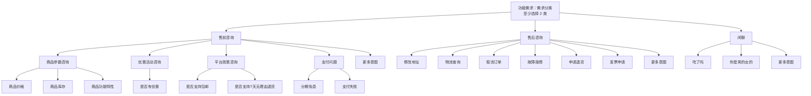
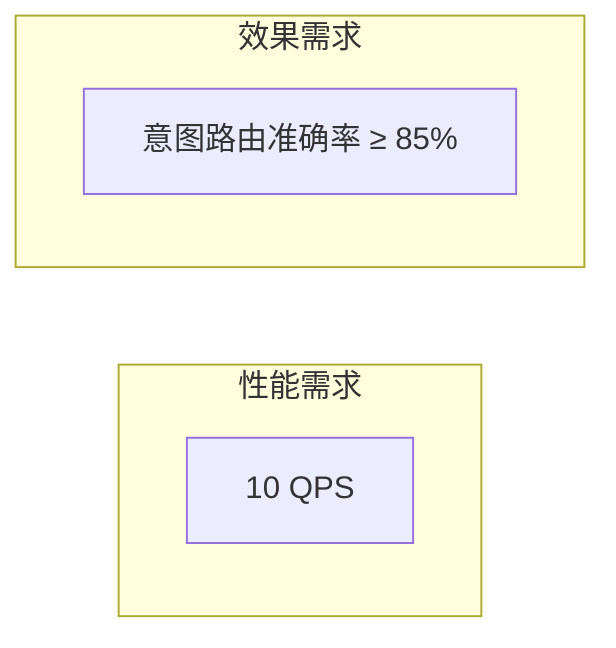
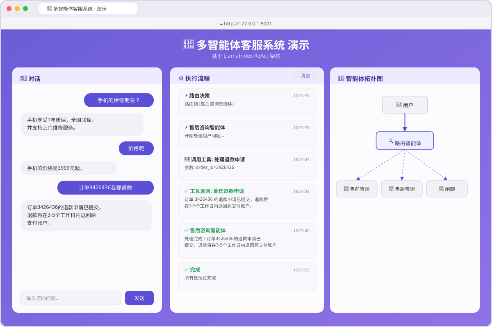
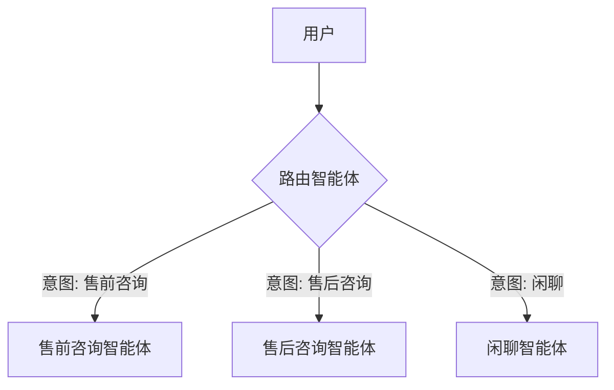
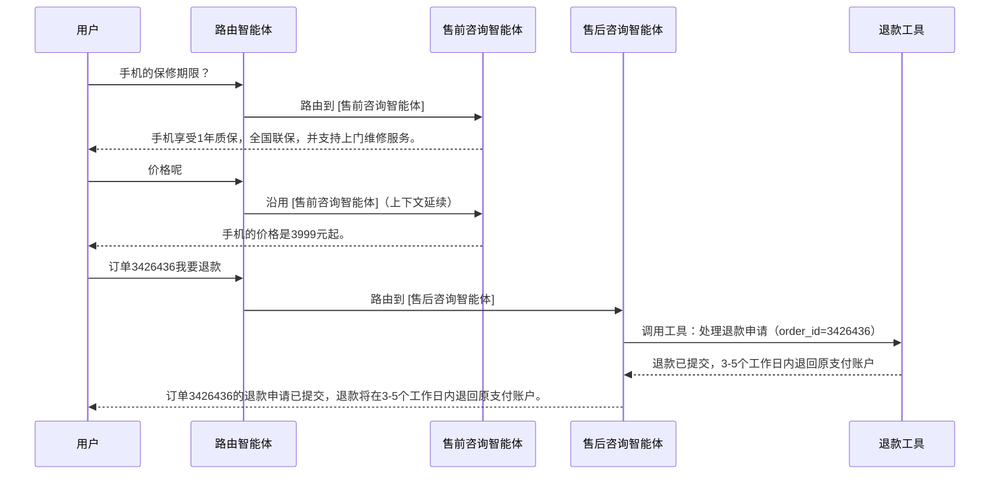

<!-- ──────────────────────────────────────────────────────────────
  prd.md ｜ 企业级高可用多智能体客服 AI 智能体系统（培训实战需求）

  为什么是这份文件      2 天工作坊的最后 0.5 天（3 小时）是分组实战：
        学员要把前 1.5 天学到的 AI Coding / SDD 方法论，在一个"看得见、
        验得了"的题目上跑通一次完整闭环——从这份 PRD 出发，spec.md /
        plan.md / tasks.md 都由 Coding Agent 起草，人只做评审（纠错
        + 补充），再交给 Coding Agent 编码、评测、部署，最后把每一轮
        评审沉淀成 learnings.md。

  刻意不加工      本文件只描述业务意图、参考素材和验收线，不指定智能体
        怎么划分、用什么框架、代码怎么写。这是有意为之：
        「PRD → 需求理解 → 方案设计 → 实现」这条推导链，正是本次实战
        要考察的能力，提前把设计给出来，练习就失去了意义。

  谁写      培训教学组。参考素材来自真实的多智能体客服系统截图与需求脑图，
        但截图文件本身未随附件一起提供，故本文件用 Mermaid 图 + 表格
        + 示例对话脚本，等价还原了截图中的关键信息（分类脑图、性能/效果
        指标、UI 三栏布局、执行流程与拓扑图），供各组直接对照实现与验收。

  下一站      各小组依次产出（模板见 templates/ 目录），每份文档都是
        Coding Agent 先起草、人评审（纠错 + 补充）后才进入下一步：
        spec.md（需求理解）→人评审→ 同时触发 plan.md（方案设计）和
        eval.md（验收判定草案：测试用例部分基于 spec.md，不改清单
        核对等部分待 plan.md 确认后补齐）两条分支 →人评审→ tasks.md
        （任务拆解，基于 plan.md）→人评审→ Coding Agent 编码实现 →
        基于 eval.md 评测验收 → 部署发布 → Coding Agent 自动读取
        spec/plan/tasks/eval 四份文档里的评审记录，生成 learnings.md，
        供下次需求开发复用。完整流程说明见本文件 §5。
────────────────────────────────────────────────────────────── -->

# PRD-2026-CMS-WORKSHOP-001｜企业级高可用多智能体客服 AI 智能体系统

> 提出：AI Coding 实战工作坊教学组　场景：招商证券 AI Coding 实战工作坊　用时：0.5 天（3 小时）分组实战

## 1. 背景

工作坊前 1.5 天完成了 AI Coding 方法论与工具训练，最后 0.5 天（3 小时）是分组实战：每组用 AI 编码工具，从一份 PRD 出发，独立完成一个**企业级高可用多智能体客服 AI 智能体系统**的需求理解、架构设计与实现，并现场演示。

选客服场景的原因：

- 业务足够贴近真实工作（证券/电商类客服都适用），意图分类清晰，不需要额外的领域知识铺垫；
- 天然适合"多智能体协作"这个训练重点——单一 Agent 硬扛所有意图会又臃肿又难兜底，必须做路由与职责拆分；
- "高可用"这个企业级要求，能强制学员在 3 小时内也要考虑异常兜底、可观测性，而不是只做一条 happy path。

参考素材：某多智能体客服系统的需求分类脑图、性能/效果指标、以及一版基于 LlamaIndex ReAct 架构的演示 UI 截图（对话 / 执行流程 / 智能体拓扑图三栏布局）。原始截图文件未随本次任务一并提供，下文用 Mermaid 图与表格等价还原了其中信息，供各组对照实现——这份还原本身也比截图更适合直接喂给 AI 编码工具做参考。

## 2. 需求

**做一个多智能体客服系统：用户输入一句话，系统能自动判断意图归属的类别，路由给对应的专业智能体处理，并给出正确、可用的答复。**

### 2.1 需求分类（至少选择 2 类落地）



- **必选**：售前咨询、售后咨询 —— 两类都要有真实可用的子智能体，不能只做路由不做处理。
- **可选加分**：闲聊类，用于兜底与体验加分（不在核心验收范围内）。
- 每一类下的具体意图（如"商品价格""申请退货"）不要求全覆盖，每类至少落地 **3 个具体场景**，能被正确识别并给出正确答复即可；其余场景可以用统一的"暂不支持，请转人工"类兜底话术承接，但**不能报错、不能无响应**。
- "申请退货 / 退款"是本次的**基准场景（Golden Path）**，所有组必须跑通（见第 7 节示例对话）。

### 2.2 非功能需求



| 类别 | 指标 | 说明 |
|---|---|---|
| 性能需求 | 10 QPS | 系统需能承受至少 10 QPS 的并发请求而不崩溃或显著降级；现场验收以模拟并发请求方式抽测。 |
| 效果需求 | 意图路由准确率 ≥ 85% | 用一批未在开发阶段用于调优的测试语句抽测，正确路由到对应智能体（且给出合理答复）的比例需 ≥ 85%。 |
| 高可用需求 | 子智能体 / 工具调用失败不能打断整体对话 | 任一子智能体或外部工具（如订单查询、退款接口）超时、报错、被限流时，系统需能重试或降级兜底（如返回"当前繁忙，请稍后再试或转人工"），不能让前端卡死或抛出未处理异常。 |
| 可观测性需求 | 关键决策与调用需可追踪 | 路由决策、被调用的智能体、工具调用（含参数）、工具返回结果需要有带时间戳的执行记录，对应 UI 的"执行流程"面板，用于问题排查与演示讲解。 |

## 3. 交互（UI 参考）

参考截图为三栏式演示界面（基于 LlamaIndex ReAct 架构的示例，仅供布局与交互参考，不强制照抄实现方式）：



> 图中的对话内容对应第 7 节的基准场景（保修期限 → 价格 → 订单退款），执行流程面板展示了路由决策、智能体调用、工具调用与返回的完整链路。

| 面板 | 内容 |
|---|---|
| 左栏「对话」 | 用户与客服的多轮对话气泡，输入框 + 发送按钮。 |
| 中栏「执行流程」 | 实时滚动展示：路由决策 → 分派到哪个子智能体 → 调用了什么工具（含参数）→ 工具返回结果 → 处理完成，每条都带时间戳；支持"清空"。 |
| 右栏「智能体拓扑图」 | 展示"用户 → 路由智能体 → {售前咨询 / 售后咨询 / 闲聊}"的静态拓扑关系图，当前被激活的路径可高亮（加分项，非必做）。 |

拓扑图等价还原：



- 三栏布局是**参考**，不是强制规范：命令行 Demo、单栏 Web 页面均可接受，但"对话结果"与"关键执行过程可见"两点是硬性要求——评审需要能看到系统"为什么这么答"，不能是黑盒。
- UI 美观度不计入核心验收分，功能正确性与可解释性优先。

## 4. 验收标准与交付物

现场演示需覆盖以下几点，缺一不可：

1. **基准场景跑通**：按第 7 节的示例对话脚本，现场演示"售前咨询（保修/价格）→ 售后咨询（退款）"的完整多轮对话，路由与答复均正确。
2. **两大类各 3 个场景**：售前咨询、售后咨询各自至少 3 个具体意图场景，现场随机抽问，正确路由并给出合理答复。
3. **准确率抽测**：评审用 ≥ 20 条未公开的测试语句现场抽测，路由准确率需 ≥ 85%。
4. **高可用兜底演示**：现场模拟一次工具调用失败或超时（如把订单接口临时改成必错），系统需能给出兜底话术而不是报错或无响应。
5. **执行过程可解释**：能展示（无论以 UI 面板、日志还是终端输出形式）路由决策与工具调用的过程，评审能看懂"系统内部发生了什么"。

交付物：

- 可运行的代码（放在仓库的 `src/` 目录，启动说明写进 `src/README.md`），由 Coding Agent 依据下方五份文档生成、人工 review 后确认；
- 五份产出文档（放在仓库根目录，模板见 `templates/` 目录，不要求逐字照抄模板结构，但要覆盖模板里列出的关键信息）。**每份都由 Coding Agent 先起草，人工评审（纠错 + 补充）后才算数**，不是人工从零手写：
  - `spec.md`（需求理解）
  - `plan.md`（方案设计）
  - `tasks.md`（任务清单）
  - `eval.md`（测试用例 + 实测结果）
  - `learnings.md`（经验沉淀，由 Coding Agent 自动读取前四份文档的评审记录生成）
- 现场 3–5 分钟演示 + 简要讲解（重点讲清智能体怎么划分、路由怎么做、失败怎么兜底）。

## 5. 实战流程与产出物（SDD 五件套）

本次实战不是"人讨论完架构直接开写"，也不是"人手写五份文档再叫 AI 编码"——**五份文档全部由 Coding Agent 起草**，人的工作是逐份评审：纠错、补充、确认，确认后才进入下一步。`eval.md` 不是单一来源：测试用例部分（§0/§1/§2/§4）只依赖 `spec.md`，跟 `plan.md` 是并行的两条分支；但不改清单核对和降级测试部分（§3/§5）结构上依赖 `plan.md`，`plan.md` 确认后补齐即可，不用等到编码完成，也不卡编码开始。`learnings.md` 则是 Coding Agent 在最后自动读取前四份文档里的评审记录生成的，人不需要在过程中另外维护一份日志：

```
prd.md（已给）
  │  Coding Agent：需求理解
  ▼
spec.md（草稿） → 人评审：纠错 + 补充 → spec.md（确认）
  │                                         │
  │ Coding Agent：方案设计                    │ Coding Agent：验收判定起草
  ▼                                         ▼
plan.md（草稿）→人评审→plan.md（确认）   eval.md（草稿）→人评审→eval.md（确认，用例部分）
  │  Coding Agent：任务设计
  ▼
tasks.md（草稿） → 人评审：纠错 + 补充 → tasks.md（确认）
  │  Coding Agent：编码实现
  ▼
代码 → 基于 eval.md 评测验收（回填实测结果） → 部署发布
  │
  ▼
Coding Agent 自动读取 spec/plan/tasks/eval 四份文档的评审记录，
以及 eval.md 的门禁结果 / 遗留问题 / 判定理由
  │
  ▼
learnings.md（草稿） → 人评审：纠错 + 补充 → learnings.md（确认）
```

> `eval.md` 分两步补全，图里只画了第一步：spec.md 确认后先起草 §0/§1/§2/§4（测试用例部分），跟 plan.md 并行；plan.md 确认后再补 §3/§5（依赖 plan.md §5 的降级设计、§6 的不改清单），不用等到编码完成，也不卡编码开始。

| 文档 | 模板 | 谁起草 | 核心问题 |
|---|---|---|---|
| spec.md | `templates/spec.template.md` | Coding Agent 基于 prd.md 起草，人评审确认 | 到底要做什么？验收口径怎么定？ |
| plan.md | `templates/plan.template.md` | Coding Agent 基于确认版 spec.md 起草，人评审确认 | 架构上怎么做？智能体怎么分、怎么兜底？ |
| eval.md | `templates/eval.template.md` | §0/§1/§2/§4 基于确认版 spec.md，§3/§5 基于确认版 plan.md 补齐，人评审确认 | 怎么证明做对了？ |
| tasks.md | `templates/tasks.template.md` | Coding Agent 基于确认版 plan.md 起草，人评审确认 | 拆成哪些可执行任务？完成标准是什么？ |
| learnings.md | `templates/learnings.template.md` | Coding Agent 自动读取前四份文档的评审记录 + eval.md 的门禁结果/遗留问题/判定理由起草，人评审确认 | 这次做下来，学到了什么、下次怎么改进？ |

几条硬规则：

- **人不从零手写这五份文档，只做评审。** 每一轮都是：Coding Agent 基于已确认的上游文档起草下一份 → 人通读、直接在文件里改错的地方、补漏的地方 → 改动记一笔到该文档自己的"变更记录" → 状态改成"确认" → 才能进入下一步。跳过评审直接放行 Agent 的草稿，是这套流程里最容易出问题的地方。
- **纠错和补充要记在对应文档自己的"变更记录"里，不用另外维护日志。** spec.md §9、plan.md §8、tasks.md 和 eval.md §8 都有"变更记录"表（eval.md 有两轮评审，都要记）；`learnings.md` 最后由 Coding Agent 自动读取这四处生成——记录及时、真实，`learnings.md` 才提炼得出东西。
- **eval.md 贡献给 learnings.md 的不止评审记录。** §3/§4 里没通过的门禁、§6 的遗留问题与未覆盖场景、§7 判定"有条件通过"的理由，都会被 `learnings.md` 一并读走——这些是"实际测出来什么"，往往比"评审时改了什么"更能说明这次哪里做得不够。所以这几节即使结论不好看也要如实填。
- **时间紧张时别凭感觉砍 spec.md 的小节。** §2（消歧）和 §5（验收标准）省了会静默出错——团队对"到底做什么"理解不一致，但谁都不会当场发现，评审时要重点盯；§3（范围与场景）、§6（非功能口径）、§9（变更记录）则是下游硬依赖，eval.md 和 learnings.md 直接从这三节取数，砍了后面会断链。真要压缩，压 §1 §4 §7 §8，具体取舍见 `templates/spec.template.md` 顶部的档位说明。
- **要求 Agent 主动交出盲区，别只交结论。** 人评审只抓得住"写错的"，抓不住"没写的"——像 spec.md §3 的 Out of Scope、plan.md §6 的不改清单这种列"不做什么/不能碰什么"的小节，漏掉的条目不占版面，对着已有内容怎么看都看不出缺口。所以这几节都要求 Agent 附一张盲区表，把"我拿不准、只能靠猜"的点显式列出来，让人做勾选裁决，而不是替人默默拍板。
- **plan.md §6 的"不改清单"要认真评审**，并在 tasks.md 的执行期约束里重申一遍：这是防止 Coding Agent 编码时把验收标准、Golden Path 对话这类硬约束也顺手改掉的关键机制。
- **eval.md 的测试用例部分（§0/§1/§2/§4）在 spec.md 确认后就起草、评审，不用等 plan.md / tasks.md**，这样编码开始前验收靶子早就定好了；但不改清单核对和降级测试部分（§3/§5）结构上依赖 plan.md，plan.md 确认后随手补齐即可，不是"整份 eval.md 都跟 plan.md 无关"。
- **部署发布是独立的一步，不能省。** 评测通过不等于能演示——把 demo 实际跑起来、确认能被现场访问，才算完成。
- 各模板的 HTML 注释里都写了"这一步该回答什么问题、不该回答什么问题、评审时要重点看什么"，评审前先看一遍。

## 6. 时间安排（3 小时参考节奏）

| 时间 | 环节 | 对应产出 |
|---|---|---|
| 0:00–0:10 | 读 prd.md，组内对齐要选哪些需求分类；让 Coding Agent 起草 spec.md | `spec.md`（草稿） |
| 0:10–0:20 | 评审 spec.md：纠错 + 补充，改动记进 spec.md §9 变更记录；确认后同时让 Agent 起草 plan.md 和 eval.md | `spec.md`（确认）、`plan.md`（草稿）、`eval.md`（草稿） |
| 0:20–0:30 | 评审 eval.md 测试用例部分（§0/§1/§2/§4）：纠错 + 补充，记进 eval.md 变更记录 | `eval.md`（§0/§1/§2/§4 确认） |
| 0:30–0:45 | 评审 plan.md：纠错 + 补充，记进 plan.md §8 变更记录；确认后让 Agent 补上 eval.md §3/§5（依赖 plan.md 的降级测试、不改清单核对）、并起草 tasks.md | `plan.md`（确认）、`eval.md`（§3/§5 草稿）、`tasks.md`（草稿） |
| 0:45–0:55 | 评审 tasks.md 与 eval.md §3/§5：纠错 + 补充，记进各自变更记录 | `tasks.md`（确认）、`eval.md`（全部确认） |
| 0:55–2:15 | Coding Agent 按确认版 tasks.md 顺序编码实现，人工滚动 review、纠偏 | 代码 + `tasks.md`（勾选状态） |
| 2:15–2:35 | 基于 eval.md 评测验收（含核对 plan.md §6 不改清单），回填实测结果，修复未达标项 | `eval.md`（实测结果 + 判定结论） |
| 2:35–2:50 | 部署发布：把 demo 实际跑起来、确认可被现场访问，准备演示脚本 | 可运行的 demo |
| 2:50–3:00 | Coding Agent 自动读取四份文档的评审记录、以及 eval.md 的门禁结果/遗留问题/判定理由，生成 `learnings.md`，人评审确认 + 现场演示 + 讲师/助教点评 | `learnings.md`（确认） |

## 7. 验收参考对话（Golden Path）

以下对话摘自参考 UI 截图，各组的系统需能跑通等价的多轮交互（措辞不要求逐字一致，但意图与结果要对应）：



## 8. 技术栈说明（不做限定）

参考素材使用的是 ReAct 架构，但本次实战**不限定框架**——用 Spring AI、Spring AI Alibaba、LangChain、LangGraph、AutoGen、自研 Router + Function Calling，或任何小组熟悉且能在 3 小时内跑通的方案都可以。评审只看第 4 节的验收标准是否达成，不对技术选型加分或扣分。

---

> **本文件到此为止。** 智能体怎么划分、路由怎么实现、降级策略怎么设计——这些属于 plan.md（方案设计）阶段的产出；具体做什么、验收口径怎么定，属于 spec.md（需求理解）阶段的产出。两者都由各小组的 Coding Agent 起草、人评审确认完成，不在本 PRD 中给出。
