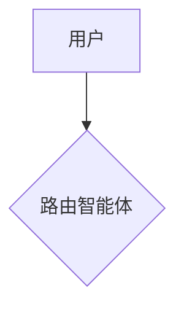

<!-- ──────────────────────────────────────────────────────────────
  plan.md ｜ 方案设计（回答"怎么做"，spec.md 的下一站）

  这一步要做什么      把 spec.md 定的"要做什么"，落成可以直接开始
        写代码的架构：智能体怎么拆、路由怎么判、工具和数据怎么设计、
        失败了怎么兜底。tasks.md 的任务清单直接从这里的模块划分展开，
        所以这里的颗粒度要能让下一步"拆任务"不用再做设计决策。

  为什么不能跳过直接写代码      3 小时时间紧张，容易想"边写边想"。
        但多智能体系统一旦先写代码后补设计，最常见的坑是：路由和
        各子智能体的职责边界越写越糊，降级逻辑补丁式地散落在各处。
        这里花 20 分钟想清楚，比编码到一半推倒重来更省时间。
────────────────────────────────────────────────────────────── -->

# PLAN-\<组名\>-001｜方案设计

## 1. 架构总览

用 Mermaid 画出你们的智能体拓扑图（可以在 prd.md §3 的参考拓扑图基础上调整）：

## 2. 智能体职责划分

| 智能体 | 负责的意图 / 场景 | 输入 | 输出 | 依赖的工具 |
|---|---|---|---|---|
| 路由智能体 | | | | |
| | | | | |

## 3. 路由策略

- 分类方式（LLM 分类 / 规则匹配 / 混合）：
- 多轮对话上下文延续策略（什么情况下沿用上一个智能体，什么情况下重新路由）：

## 4. 工具与数据设计

- Mock 数据结构（订单、商品、物流等，给出字段示例）：
- 工具函数签名列表（函数名 / 参数 / 返回值 / 可能的失败方式）：

## 5. 高可用与降级设计

| 故障场景 | 触发条件 | 兜底行为 | 是否重试 |
|---|---|---|---|
| 工具调用超时 | | | |
| 工具调用报错 | | | |
| LLM 被限流 / 报错 | | | |

可观测性方案：路由决策、Agent 调用、工具调用与返回怎么记录（对应 prd.md §3 的"执行流程"面板要求）？

## 6. 技术栈选型

- 模型：
- 多智能体框架：
- 前后端 / 展示方式：

## 7. 关键时序图

可直接引用 / 扩展 prd.md §7 的 Golden Path 时序图，并补充你们组新增场景的时序图。

## 8. 风险与备选方案（Plan B）

如果主方案在编码阶段行不通，退路是什么？

-
